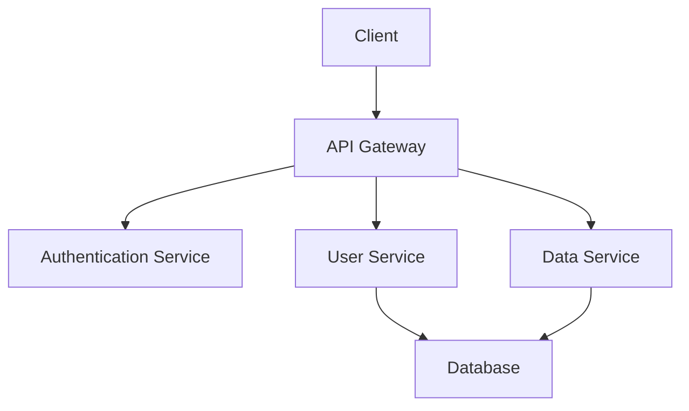

# ADK (Advanced Development Kit)

## Project Overview
The Advanced Development Kit (ADK) is designed to streamline the development process and provide tools that enhance productivity and collaboration among developers.

## Architecture Diagram


## Features
- User Authentication
- API Integration
- Scalable Services
- Real-time Data Processing
- User-friendly Interface

## Installation Instructions
1. Clone the repository:
   ```bash
   git clone https://github.com/Harikishan-AI/ADK.git
   ```
2. Navigate into the project directory:
   ```bash
   cd ADK
   ```
3. Install the dependencies:
   ```bash
   npm install
   ```

## Usage Guide
To run the application, use the following command:
```bash
npm start
```

## Project Structure
```
ADK/
│
├── src/                  # Source files
│   ├── components/       # React components
│   ├── services/         # API Services
│   └── utils/            # Utility functions
│
├── public/               # Public assets
│   └── index.html        # Main HTML file
│
├── package.json          # Project metadata
├── README.md             # Project documentation
```

## License
This project is licensed under the MIT License.
